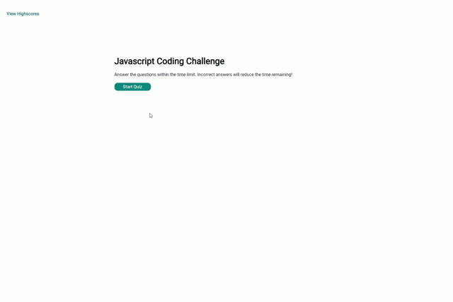

# Coding Quiz Game
## Overview
In this project I created a Javascript themed quiz game. When the game is started, a timer starts and the user is presented with the first question. If a question is answered incorrectly, time is deducted. The game will move through all questions or until the timer runs out. At the end, the user is presented with their score and if it is a highscore they will have the option to add themselves to the highscore table. The highscore table is in local storage so the user can always come back to the game and try and beat their scores.

## The Quiz
For the quiz, the questions are stored in an array of objects. Each object contains the question, an array of answers and the correct answer. I designed the game this way, so that questions can be added or removed and the game will still function the same way

When the start button is pressed, it triggers the timer to start and the renderQuestion function to begin. The renderQuestion function loops through the quiz array until all questions have been answered or the timer has expired.

## Finishing the quiz
Once the final question has been answered or the timer expires - the finishQuiz function is called. This function first of all clears the screen before displaying the users score. The function will then make sure only the top 10 highscores are being saved and then compares the users score to the lowest score on the highscore array to see if a new highscore was set.

The option to add yourself to the highscore table will only appear if a new highscore was set.

## Highscores
The highscores are stored as an array of objects, each object storing the name & score properties. When the submit button is clicked to submit a new highscore, as long as the name value isn't blank, we push the users name and score to the highscores array. I then run a small function to sort the objects in the highscores array by score - highest to lowest. This ensures that the highscores are saved and displayed highest to lowest.

Once the highscore is saved, we render the highscores table. The renderHighscores function first clears the screen and clears the table. If the table is not cleared and the highscore table is accessed more than once without the page refreshing, we would experience duplicate listings.

After clearing the screen and the table, we generate a new table using the highscore objects to fill in the names and scores. The highscore table will only ever display the top 10 highscores and our local storage will never store more than the top 10 also.

